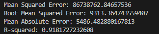
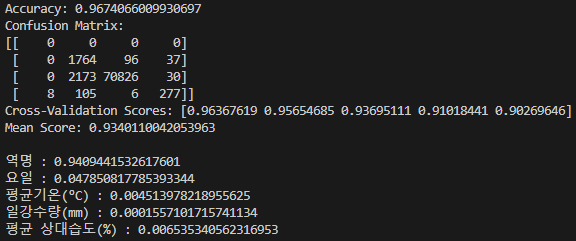

# DataScienceTermP
## 가천대학교 2023년 1학기 데이터과학

```
Team Member
- Seon (I.E.)
- Lee H (SW)
- Lee J (Sw)
- Lee Y (SW)
```

-----
### Data Reference

https://www.data.go.kr/data/15044225/fileData.do

https://data.seoul.go.kr/dataList/OA-12913/S/1/datasetView.do

https://data.kma.go.kr/data/grnd/selectAsosRltmList.do?pgmNo=36

https://data.seoul.go.kr/dataList/OA-12252/S/1/datasetView.do

-----
You can run a function on the model by downloading only the dataset posted on git.

-----
We use Two Model.
- Regression : multi_linear_regression.py



- GradientBoostingClassifier : gradient_boosting.py

